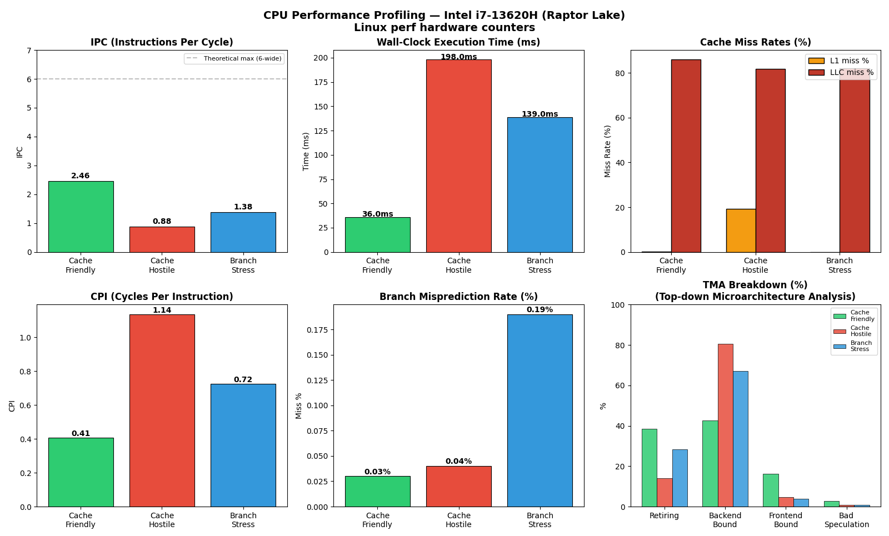

# CPU Performance Profiling — Intel i7-13620H (Raptor Lake)

> **Linux perf · Hardware PMU Counters · TMA · Python Visualization**

A 1–2 day hands-on project profiling real CPU microarchitecture behavior using Linux `perf` and Intel's Top-down Microarchitecture Analysis (TMA). Three micro-benchmarks deliberately stress isolated pipeline subsystems, making bottlenecks visible through hardware counter data.

---

## System

| Field   | Value                                      |
|---------|--------------------------------------------|
| CPU     | Intel Core i7-13620H (Raptor Lake, 13th Gen) |
| Cores   | 6P-cores + 4E-cores (hybrid big.LITTLE)    |
| Kernel  | 6.17.0-23-generic                          |
| perf    | 6.17.13                                    |
| OS      | Ubuntu 24                                  |

---

## Project Structure

```
cpu_perf_project/
├── src/
│   ├── cache_friendly.c       # Sequential memory access benchmark
│   ├── cache_hostile.c        # Strided/random access benchmark
│   └── branch_stress.c        # Unpredictable branch benchmark
├── results/
│   ├── stat_cache_friendly.txt
│   ├── stat_cache_hostile.txt
│   └── stat_branch_stress.txt
├── plots/
│   ├── analyze.py             # Python parser + 6-panel visualization
│   └── perf_analysis.png      # Output figure
└── venv/                      # Python virtual environment
```

---

## Benchmarks

| Binary           | Stresses                  | Pipeline Unit Targeted     |
|------------------|---------------------------|----------------------------|
| `cache_friendly` | Sequential memory access  | Cache hierarchy (L1→LLC)   |
| `cache_hostile`  | Strided access (stride-64)| DRAM bandwidth & latency   |
| `branch_stress`  | Unpredictable branches    | Branch predictor + ROB     |

> Compiled with `-O1` to prevent the compiler from optimizing away intentional inefficiencies.

---

## Results

### Hardware Counter Summary (P-core / `cpu_core` values)

```
Benchmark        IPC    CPI    L1 Miss%   LLC Miss%   Branch Miss%   Time
──────────────────────────────────────────────────────────────────────────
cache_friendly   2.46   0.41   0.24%      85.90%      0.03%          36ms
cache_hostile    0.88   1.14   19.29%     81.83%      0.04%         198ms
branch_stress    1.38   0.72   0.05%      81.94%      0.19%         139ms
```

### TMA (Top-down Microarchitecture Analysis)

```
Benchmark        Retiring   Backend Bound   Frontend Bound   Bad Speculation
──────────────────────────────────────────────────────────────────────────────
cache_friendly   38.6%      42.5%           16.1%            2.8%
cache_hostile    14.0%      80.5%  ← !!     4.7%             0.9%
branch_stress    28.2%      67.1%           3.9%             0.8%
```

### Visualization



---

## Key Findings

### 1 — Cache Hostile is 5.9× Slower with the Same Instruction Count
`cache_hostile` executes a similar number of instructions as `cache_friendly` but takes **198ms vs 36ms**. IPC dropped from **2.46 → 0.88**. The pipeline was stalled waiting for DRAM ~85% of the time. TMA confirms: **80.5% backend-bound**.

This is the hardware equivalent of a structural hazard stall in a pipelined RTL design — a downstream resource (DRAM) is unavailable, so the pipeline inserts bubbles.

### 2 — Hybrid Core Architecture Visible in Raw perf Output
Linux perf exposes **separate PMU counter sets** for P-cores (`cpu_core`) and E-cores (`cpu_atom`). The OS scheduler ran ~99% of the work on P-cores but occasionally migrated to E-cores. E-core IPC on `cache_hostile` was **0.42 vs P-core 0.88** — E-cores have shallower out-of-order buffers and hide memory latency less effectively.

### 3 — Branch Predictor Strength: 0.19% Miss Rate on Random Data
The `branch_stress` benchmark used `rand() % 2` — theoretically unpredictable. Yet the modern Intel predictor achieved only **0.19% branch miss rate**. The actual bottleneck was **random load addresses** for `arr[i]`, not branch resolution. IPC of 1.38 and 67.1% backend-bound confirm memory latency, not misprediction, as root cause. TMA separated the symptom from the root cause.

---

## Setup & Reproduction

### 1 — Enable hardware counter access
```bash
sudo sysctl -w kernel.perf_event_paranoid=0
# Make permanent:
echo 'kernel.perf_event_paranoid=0' | sudo tee -a /etc/sysctl.conf
```

### 2 — Compile benchmarks
```bash
cd src/
gcc -O1 -o cache_friendly  cache_friendly.c
gcc -O1 -o cache_hostile   cache_hostile.c
gcc -O1 -o branch_stress   branch_stress.c
```

### 3 — Run perf stat
```bash
perf stat -e cycles,instructions,cache-misses,cache-references,\
branch-misses,branches,L1-dcache-loads,L1-dcache-load-misses \
./cache_friendly 2>&1 | tee ../results/stat_cache_friendly.txt

perf stat -e cycles,instructions,cache-misses,cache-references,\
branch-misses,branches,L1-dcache-loads,L1-dcache-load-misses \
./cache_hostile 2>&1 | tee ../results/stat_cache_hostile.txt

perf stat -e cycles,instructions,cache-misses,cache-references,\
branch-misses,branches,L1-dcache-loads,L1-dcache-load-misses \
./branch_stress 2>&1 | tee ../results/stat_branch_stress.txt
```

### 4 — Generate TMA summary
```bash
perf stat ./cache_friendly 2>&1 | tee ../results/ipc_friendly.txt
perf stat ./cache_hostile  2>&1 | tee ../results/ipc_hostile.txt
perf stat ./branch_stress  2>&1 | tee ../results/ipc_branch.txt
```

### 5 — Plot results
```bash
cd ..
python3 -m venv venv && source venv/bin/activate
pip install matplotlib pandas numpy
cd plots && python analyze.py
```

---

## Interview Q&A

**Q: What is IPC and why does it matter?**
IPC (Instructions Per Cycle) measures pipeline utilization efficiency. A 6-wide superscalar like the i7-13620H has a theoretical max of 6 IPC. My `cache_friendly` benchmark achieved 2.46 — healthy utilization. `cache_hostile` dropped to 0.88 — the pipeline was stalled waiting for DRAM most of the time. In RTL terms, this is identical to a `valid` signal going low because a downstream FIFO is full.

**Q: What does TMA tell you that raw counters don't?**
Raw counters tell you *what* happened (e.g., cache misses). TMA tells you *where the pipeline slots went*. 80.5% backend-bound on `cache_hostile` immediately confirms DRAM latency as root cause — no guessing required. It's like a coverage report that points to the uncovered RTL block.

**Q: Why was branch_stress not actually bottlenecked by branches?**
Modern Intel branch predictors learn statistical patterns in pseudo-random sequences. The 0.19% miss rate proves this. The real bottleneck was random *memory loads* (`arr[i]` at random addresses), not branch resolution. TMA showed 67.1% backend-bound — memory latency, not bad speculation (0.8%).

**Q: What did you observe about the hybrid P/E architecture?**
Linux perf exposes separate `cpu_core` and `cpu_atom` counter sets. The scheduler distributed ~99% of work to P-cores but the E-core `cpu_atom` counters showed small slices of execution. E-core IPC was measurably lower on memory-bound workloads, confirming that shallower out-of-order buffers reduce their ability to hide DRAM latency.

**Q: How does this connect to your RTL/VLSI background?**
Directly. A cache miss stall = structural hazard in a pipelined processor. The ROB is the hardware scoreboard. TMA's "backend bound" = stall due to load-use hazard. Branch misprediction = pipeline flush, identical to a mis-predicted jump flushing a 5-stage pipeline. The only difference is scale — an OOO core has hundreds of in-flight instructions masking some of that latency through hardware speculation.

---

## Skills Demonstrated

`Linux perf` · `PMU hardware counters` · `IPC / CPI analysis` · `TMA (Top-down Microarchitecture Analysis)` · `Cache hierarchy profiling` · `Branch predictor analysis` · `Hybrid core architecture (P+E cores)` · `Python data visualization` · `x86 microarchitecture` · `C micro-benchmarking`

---

## Author

**Vedansh** — RTL / FPGA / VLSI Engineer exploring CPU microarchitecture and performance engineering.
